<h1 align="center">ICONNET Platform - AI-Powered Telecommunications Management</h1>

<p align="center">
  <a href="https://github.com/rizkyyanuark/intern-iconnet">
    
  </a>
  <a href="https://github.com/rizkyyanuark/intern-iconnet">
    
  </a>
  <a href="https://github.com/rizkyyanuark/intern-iconnet">
    
  </a>
  <a href="https://github.com/rizkyyanuark/intern-iconnet">
    
  </a>
  <a href="https://opensource.org/licenses/MIT">
    
  </a>
</p>

## Feature

- [`Streamlit`](https://streamlit.io/) untuk web interface dan dashboard
- [`LangChain`](https://github.com/langchain-ai/langchain) & [`LangGraph`](https://github.com/langchain-ai/langgraph) untuk agentic workflow AI
- [`PostgreSQL`](https://postgresql.org/) & [`Supabase`](https://supabase.com/) untuk database management
- [`Apache Airflow`](https://airflow.apache.org/) untuk ETL pipeline workflow
- [`Google Gemini AI`](https://ai.google.dev/) untuk LLM integration
- [`Firebase`](https://firebase.google.com/) untuk authentication
- [`pgvector`](https://github.com/pgvector/pgvector) untuk RAG system
- [`uv`](https://docs.astral.sh/uv/) untuk manajemen environment Python

## 🏗️ Architecture



## Instalasi & Setup (Local)

```powershell
# Clone repository
git clone https://github.com/PT-Indonesia-Comnets-Plus/database-management-web.git
cd intern-iconnet

# Setup Python (opsional, untuk development)
uv venv
uv sync

# Copy dan edit file .secret
cp .secret_example.toml
# Edit .secret sesuai kebutuhan

uv run streamlit run Main_Page.py

```

### Fitur Utama

#### 1. Authentication & User Management

- Login/Register melalui Firebase Authentication
- Role-based access (Admin/User)
- Session management

#### 2. AI Assistant (RAG-powered)

Platform memiliki AI assistant yang menggunakan sistem RAG untuk menjawab pertanyaan tentang:

- Data telekomunikasi internal
- Informasi ICONNET dan PLN
- Query database dengan natural language

**Contoh penggunaan:**

```
User: "Apa itu ICONNET dan layanan apa saja yang tersedia?"
AI: "ICONNET adalah anak perusahaan PLN yang menyediakan layanan internet fiber optik..."

User: "Tampilkan data asset di Jakarta"
AI: [Menggunakan SQL Agent untuk query database]
```

#### 3. Database Management dengan AI

- Natural language to SQL conversion
- Visual query builder
- Data visualization otomatis
- ETL pipeline integration

#### 4. Geospatial Data Visualization

- Interactive maps dengan Folium
- Asset location tracking
- Coordinate data cleaning dan standardization

#### 5. ETL Pipeline (Apache Airflow)

Pipeline untuk processing data telekomunikasi:

- Extract dari Google Sheets dan sumber lain
- Transform koordinat dan data asset
- Validate dan split ke multiple tables
- Load ke database PostgreSQL

**Workflow ETL:**

```
1. extract → 2. transform_asset_data → 3. transform_user_data →
4. validate_and_splitting → 5. load → 6. send_notification_email
```

### Chat dengan AI Assistant

**Endpoint internal:** Akses melalui sidebar Streamlit

**Contoh request natural language:**

```
User: "Berapa total asset di Jakarta?"
AI Agent: [Menggunakan SQL Agent untuk query database]

User: "Apa itu ICONNET dan layanan apa saja?"
AI Agent: [Menggunakan RAG untuk cari informasi internal]

User: "Buatkan visualisasi data asset per region"
AI Agent: [Menggunakan Visualization Tool untuk generate chart]
```

**Workflow AI Agent:**

```
User Input → Intent Analysis → Tool Selection →
SQL Agent / RAG Search / Visualization / Web Search →
Response Generation → User Output
```

### ETL Pipeline Trigger

**Endpoint internal:** Akses melalui AI Assistant

**Contoh usage:**

```
User: "Jalankan ETL pipeline untuk data terbaru"
AI Agent: [Menggunakan Airflow Trigger Tool]

User: "Cek status ETL pipeline terakhir"
AI Agent: [Query Airflow API untuk status]
```

## Configuration

### 1. Streamlit Secrets

Edit `.streamlit/secrets.toml`:

```toml
[database]
# PostgreSQL Database Configuration
DB_HOST = ""
DB_NAME = ""
DB_USER = ""
DB_PASSWORD = ""
DB_PORT = ""

[supabase]
# Supabase Configuration (if using Supabase)
url = ""
service_role_key = ""

[firebase]
# Firebase Configuration
firebase_key_json = """
{
  "type": "service_account",
  "project_id": "",
  "private_key_id": "",
  "private_key": "",
  "client_email": "",
  "client_id": "",
  "auth_uri": "",
  "token_uri": "",
  "auth_provider_x509_cert_url": "",
  "client_x509_cert_url": "",
  "universe_domain": ""
}
"""

# This firebase_api is at the root level, consistent with your secrets.toml
firebase_api = ""

# SMTP Configuration
[smtp]
server = ""
port = ""
username = ""
password = ""

# Gemini Configuration
[gemini]
api_key = ""

# Langsmith Configuration
[langsmith]
api_key = ""

# Tavily Configuration
[tavily]
api_key = ""

# Airflow Configuration
[airflow]
base_url = ""
username = ""
password = ""

# Instructions:
# 1. Copy this file to .streamlit/secrets.toml
# 2. Replace all placeholder values with your actual configuration
# 3. Make sure .streamlit/secrets.toml is in your .gitignore
# 4. For local development, you can leave some sections empty to run in demo mode
```

## Deployment ke VPS/Cloud

1. Deploy VM (Ubuntu) di cloud provider (GCP, AWS, Azure)
2. Install PostgreSQL, Docker (opsional)
3. Clone repo & setup environment
4. Konfigurasi `.streamlit/secrets.toml` dengan production values
5. Jalankan:
   ```bash
   pip install uv
   uv venv
   uv sync
   uv run streamlit run Main_Page.py
   ```
6. (Opsional) Setup Nginx reverse proxy & SSL untuk domain

---

> Project ini dikembangkan untuk manajemen infrastruktur telekomunikasi modern dengan AI-powered analytics, siap untuk deployment di cloud maupun on-premise.
